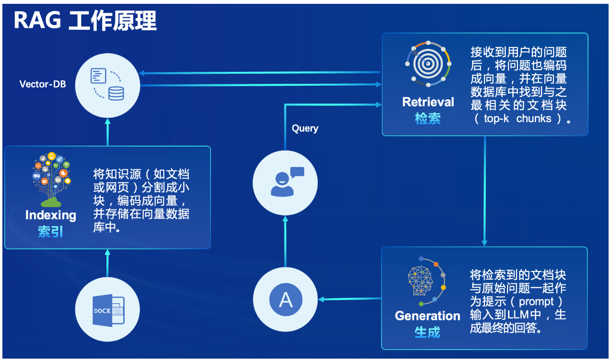
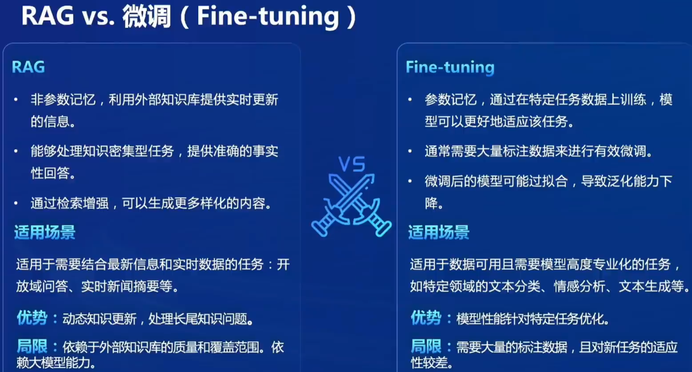
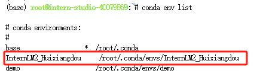
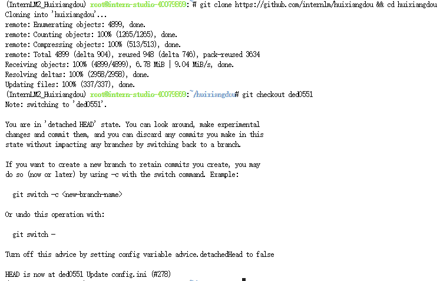
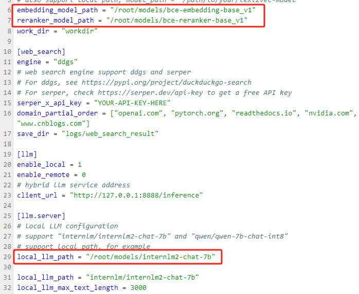
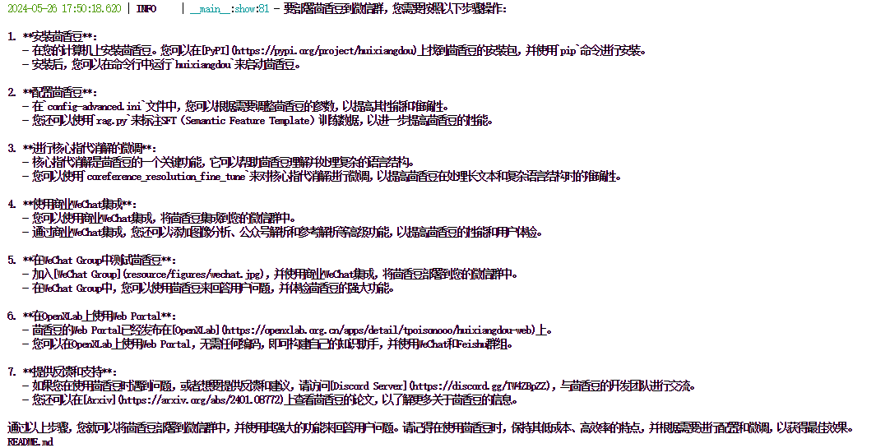

# InternLM第三课笔记-茴香豆：搭建RAG 智能助理

## 0 RAG 概述

RAG（Retrieval Augmented Generation）技术，通过检索与用户输入相关的信息片段，并结合*外部知识库*来生成更准确、更丰富的回答。解决 LLMs 在处理知识密集型任务时可能遇到的挑战, 如幻觉、知识过时和缺乏透明、可追溯的推理过程等。提供更准确的回答、降低推理成本、实现外部记忆。



RAG 能够让基础模型实现非参数知识更新，**无需训练**就可以掌握新领域的知识。本次课程选用的[茴香豆](https://github.com/InternLM/HuixiangDou)应用，就应用了 RAG 技术，可以快速、高效的搭建自己的知识领域助手。只需更新向量数据库就可以将LLM的生成能力和向量数据库中的内容很好的结合。



## 1 环境配置

### 1.1 配置基础环境

[详细过程](https://github.com/InternLM/Tutorial/blob/camp2/huixiangdou/readme.md#1-%E7%8E%AF%E5%A2%83%E9%85%8D%E7%BD%AE)



### 1.2 下载基础文件

复制茴香豆所需模型文件，为了减少下载和避免 **HuggingFace** 登录问题，所有作业和教程涉及的模型都已经存放在 `Intern Studio` 开发机共享文件中。本教程选用 **InternLM2-Chat-7B** 作为基础模型。


### 1.3 下载安装茴香豆

安装茴香豆运行所需依赖。

```shell
# 安装 python 依赖
# pip install -r requirements.txt

pip install protobuf==4.25.3 accelerate==0.28.0 aiohttp==3.9.3 auto-gptq==0.7.1 bcembedding==0.1.3 beautifulsoup4==4.8.2 einops==0.7.0 faiss-gpu==1.7.2 langchain==0.1.14 loguru==0.7.2 lxml_html_clean==0.1.0 openai==1.16.1 openpyxl==3.1.2 pandas==2.2.1 pydantic==2.6.4 pymupdf==1.24.1 python-docx==1.1.0 pytoml==0.1.21 readability-lxml==0.8.1 redis==5.0.3 requests==2.31.0 scikit-learn==1.4.1.post1 sentence_transformers==2.2.2 textract==1.6.5 tiktoken==0.6.0 transformers==4.39.3 transformers_stream_generator==0.0.5 unstructured==0.11.2

## 因为 Intern Studio 不支持对系统文件的永久修改，在 Intern Studio 安装部署的同学不建议安装 Word 依赖，后续的操作和作业不会涉及 Word 解析。
## 想要自己尝试解析 Word 文件的同学，uncomment 掉下面这行，安装解析 .doc .docx 必需的依赖
# apt update && apt -y install python-dev python libxml2-dev libxslt1-dev antiword unrtf poppler-utils pstotext tesseract-ocr flac ffmpeg lame libmad0 libsox-fmt-mp3 sox libjpeg-dev swig libpulse-dev
```

从茴香豆官方仓库下载茴香豆。

```
cd /root
# 克隆代码仓库
git clone https://github.com/internlm/huixiangdou && cd huixiangdou
git checkout ded0551
```

茴香豆工具在 `Intern Studio` 开发机的安装工作结束。如果部署在自己的服务器上，参考上节课模型下载内容或本节 [3.4 配置文件解析](https://github.com/InternLM/Tutorial/blob/camp2/huixiangdou/readme.md#34-%E9%85%8D%E7%BD%AE%E6%96%87%E4%BB%B6%E8%A7%A3%E6%9E%90) 部分内容下载模型文件。



## 2 使用茴香豆搭建 RAG 助手

### 2.1 修改配置文件

用已下载模型的路径替换 `/root/huixiangdou/config.ini` 文件中的默认模型，需要修改 3 处模型地址，分别是:

命令行输入下面的命令，修改用于向量数据库和词嵌入的模型

```shell
sed -i '6s#.*#embedding_model_path = "/root/models/bce-embedding-base_v1"#' /root/huixiangdou/config.ini
```

用于检索的重排序模型

```shell
sed -i '7s#.*#reranker_model_path = "/root/models/bce-reranker-base_v1"#' /root/huixiangdou/config.ini
```

和本次选用的大模型

```shell
sed -i '29s#.*#local_llm_path = "/root/models/internlm2-chat-7b"#' /root/huixiangdou/config.ini
```



### 2.2 创建知识库

本示例中，使用 **InternLM** 的 **Huixiangdou** 文档作为新增知识数据检索来源，在不重新训练的情况下，打造一个 **Huixiangdou** 技术问答助手。

首先，下载 **Huixiangdou** 语料：

```shell
cd /root/huixiangdou && mkdir repodir

git clone https://github.com/internlm/huixiangdou --depth=1 repodir/huixiangdou
```

提取知识库特征，创建向量数据库。数据库向量化的过程应用到了 **LangChain** 的相关模块，默认嵌入和重排序模型调用的网易  **BCE 双语模型** ，如果没有在 `config.ini` 文件中指定本地模型路径，茴香豆将自动从 **HuggingFace** 拉取默认模型。

除了语料知识的向量数据库，茴香豆建立接受和拒答两个向量数据库，用来在检索的过程中更加精确的判断提问的相关性，这两个数据库的来源分别是：

* 接受问题列表，希望茴香豆助手回答的示例问题
  * 存储在 `huixiangdou/resource/good_questions.json` 中
* 拒绝问题列表，希望茴香豆助手拒答的示例问题
  * 存储在 `huixiangdou/resource/bad_questions.json` 中
  * 其中多为技术无关的主题或闲聊
  * 如："nihui 是谁", "具体在哪些位置进行修改？", "你是谁？", "1+1"

（1）运行命令，增加茴香豆相关的问题到接受问题示例中

（2）再创建一个测试用的问询列表，用来测试拒答流程是否起效

（3）在确定好语料来源后，运行下面的命令，创建 RAG 检索过程中使用的向量数据库

完成后，**Huixiangdou** 相关的新增知识就以向量数据库的形式存储在 `workdir` 文件夹下。

检索过程中，茴香豆会将输入问题与两个列表中的问题在向量空间进行相似性比较，判断该问题是否应该回答，避免群聊过程中的问答泛滥。确定的回答的问题会利用基础模型提取关键词，在知识库中检索 `top K` 相似的 `chunk`，综合问题和检索到的 `chunk` 生成答案。


### 2.3 运行茴香豆知识助手

我们已经提取了知识库特征，并创建了对应的向量数据库。现在，让我们来测试一下效果：

命令行运行：

```shell
# 填入问题
sed -i '74s/.*/    queries = ["huixiangdou 是什么？", "茴香豆怎么部署到微信群", "今天天气怎么样？"]/' /root/huixiangdou/huixiangdou/main.py

# 运行茴香豆
cd /root/huixiangdou/
python3 -m huixiangdou.main --standalone
```

RAG 技术的优势就是非参数化的模型调优，这里使用的仍然是基础模型 `InternLM2-Chat-7B`， 没有任何额外数据的训练。面对同样的问题，我们的**茴香豆技术助理**能够根据我们提供的数据库生成准确的答案.

作业：在 `InternLM Studio` 上部署茴香豆技术助手


