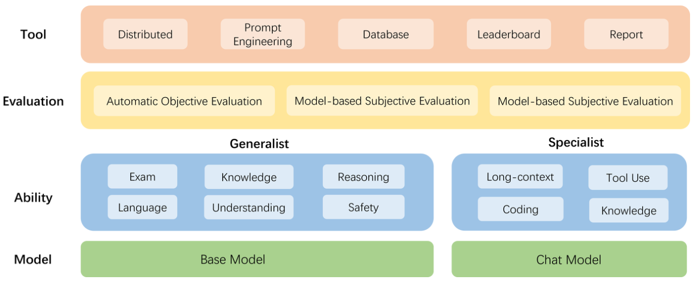
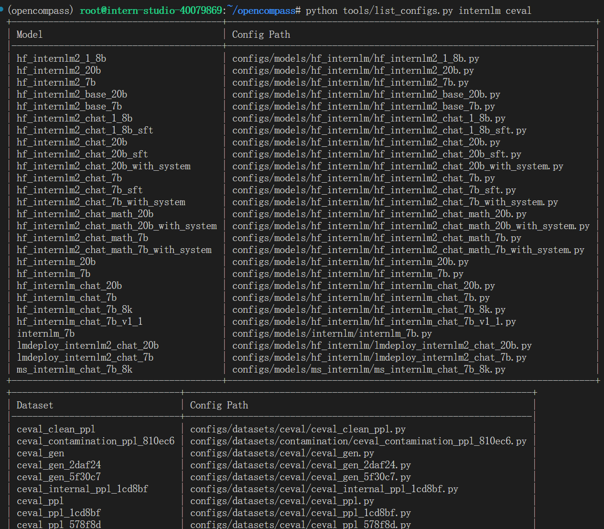
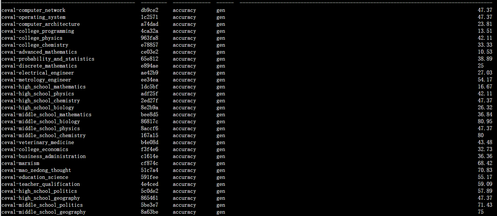

# InternLM第七课-OpenCompass 大模型评测实战

## 1. OpenCompass介绍

上海人工智能实验室科学家团队正式发布了大模型开源开放评测体系 “司南” (OpenCompass2.0)，用于为大语言模型、多模态模型等提供一站式评测服务。其主要特点如下：

* 开源可复现：提供公平、公开、可复现的大模型评测方案
* 全面的能力维度：五大维度设计，提供 70+ 个数据集约 40 万题的的模型评测方案，全面评估模型能力
* 丰富的模型支持：已支持 20+ HuggingFace 及 API 模型
* 分布式高效评测：一行命令实现任务分割和分布式评测，数小时即可完成千亿模型全量评测
* 多样化评测范式：支持零样本、小样本及思维链评测，结合标准型或对话型提示词模板，轻松激发各种模型最大性能
* 灵活化拓展：想增加新模型或数据集？想要自定义更高级的任务分割策略，甚至接入新的集群管理系统？OpenCompass 的一切均可轻松扩展！

## 1.1 评测对象

本算法库的主要评测对象为语言大模型与多模态大模型。我们以语言大模型为例介绍评测的具体模型类型。

* 基座模型：一般是经过海量的文本数据以自监督学习的方式进行训练获得的模型（如OpenAI的GPT-3，Meta的LLaMA），往往具有强大的文字续写能力。
* 对话模型：一般是在的基座模型的基础上，经过指令微调或人类偏好对齐获得的模型（如OpenAI的ChatGPT、上海人工智能实验室的书生·浦语），能理解人类指令，具有较强的对话能力。


## 1.2 工具架构



* 模型层：大模型评测所涉及的主要模型种类，OpenCompass 以基座模型和对话模型作为重点评测对象。
* 能力层：OpenCompass 从本方案从通用能力和特色能力两个方面来进行评测维度设计。在模型通用能力方面，从语言、知识、理解、推理、安全等多个能力维度进行评测。在特色能力方面，从长文本、代码、工具、知识增强等维度进行评测。
* 方法层：OpenCompass 采用客观评测与主观评测两种评测方式。客观评测能便捷地评估模型在具有确定答案（如选择，填空，封闭式问答等）的任务上的能力，主观评测能评估用户对模型回复的真实满意度，OpenCompass 采用基于模型辅助的主观评测和基于人类反馈的主观评测两种方式。
* 工具层：OpenCompass 提供丰富的功能支持自动化地开展大语言模型的高效评测。包括分布式评测技术，提示词工程，对接评测数据库，评测榜单发布，评测报告生成等诸多功能。

## 2. 数据准备

* 解压评测数据集到 data/ 处

```shell
cp /share/temp/datasets/OpenCompassData-core-20231110.zip /root/opencompass/
unzip OpenCompassData-core-20231110.zip
```

将会在 OpenCompass 下看到data文件夹

* 查看支持的数据集和模型

列出所有跟 InternLM 及 C-Eval 相关的配置

```shell
python tools/list_configs.py internlm ceval
```



* 启动评测 (10% A100 8GB 资源)

确保按照上述步骤正确安装 OpenCompass 并准备好数据集后，可以通过以下命令评测 InternLM2-Chat-1.8B 模型在 C-Eval 数据集上的性能。由于 OpenCompass 默认并行启动评估过程，我们可以在第一次运行时以 --debug 模式启动评估，并检查是否存在问题。在 --debug 模式下，任务将按顺序执行，并实时打印输出。

```shell
python run.py --datasets ceval_gen --hf-path /share/new_models/Shanghai_AI_Laboratory/internlm2-chat-1_8b --tokenizer-path /share/new_models/Shanghai_AI_Laboratory/internlm2-chat-1_8b --tokenizer-kwargs padding_side='left' truncation='left' trust_remote_code=True --model-kwargs trust_remote_code=True device_map='auto' --max-seq-len 1024 --max-out-len 16 --batch-size 2 --num-gpus 1 --debug
```


