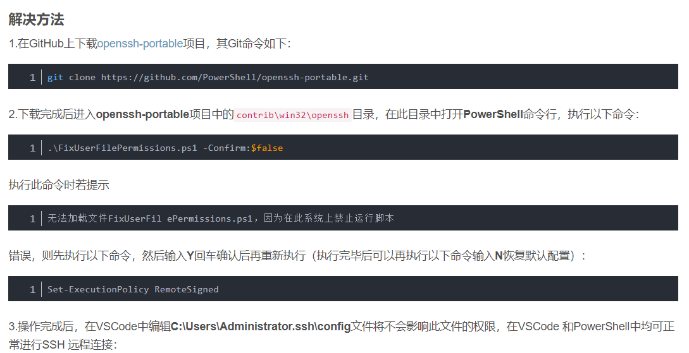
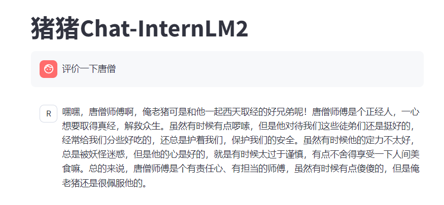

# InternLM第二课笔记-书生·浦语大模型趣味 Demo

# 实战任务一：部署 InternLM2-Chat-1.8B

创建 Intern Studio 开发机，通过 Modelscope 下载 InternLM2-Chat-1.8B 模型，完成 Client Demo 的部署和交互。

# 实战任务二：部署八戒-Chat-1.8B

通过 OpenXLab 部署 XiYou 系列的 八戒-Chat- 1.8B 模型，完成 Web Demo 的部署和交互。

部署中碰到一个问题：

* 在Windows系统下的VSCode安装**Remote-SSH**扩展后，使用扩展配置 SSH并进行远程连接，可能会发生**Bad owner or permissions on C:\Users\Administrator/.ssh/config**错误，造成无法进行SSH远程连接的问题。原因是由于使用**Remote-SSH**扩展所依赖的**Remote-SSH:Editing Configuration Files** 扩展编辑了**C:\Users\Administrator.ssh\config**文件后，此文件的权限发生了改变。编辑了%USER HOME%.ssh\config文件后，不但在VSCode中由于配置文件权限问题而无法进行SSH远程连接，就连使用系统的**PowerShell** 进行SSH连接时也会报此错误，而把此配置文件删除后，使用**PowerShell**即可正常进行远程连接。但VSCode的SSH连接又依赖此配置文件，所以就产生了冲突，要么只有**PowerShell**能用，要么就都不能用。
  

# 实战任务三：进阶 运行 Lagent 智能体 Demo

实战算力升级之后，以 InternLM2-Chat-7B 为基础，运行开源框架 Lagent 的智能体 Demo。

# 实战任务四：进阶 灵笔 InternLM-XComposer2

浅尝多模态实践，通过 InternLM-XComposer2 模型实现更加强大的图文生成式写作。
