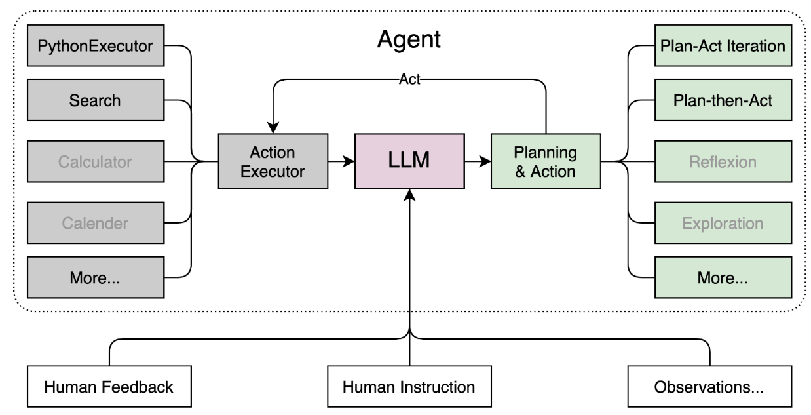
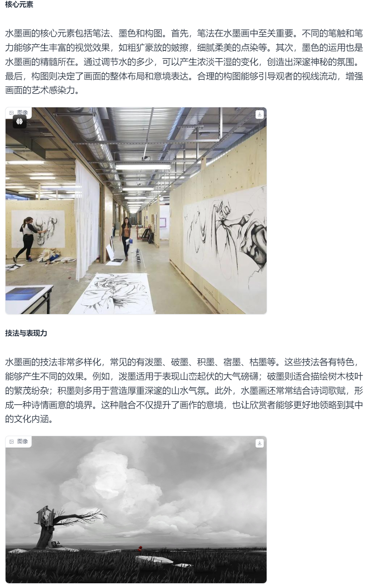
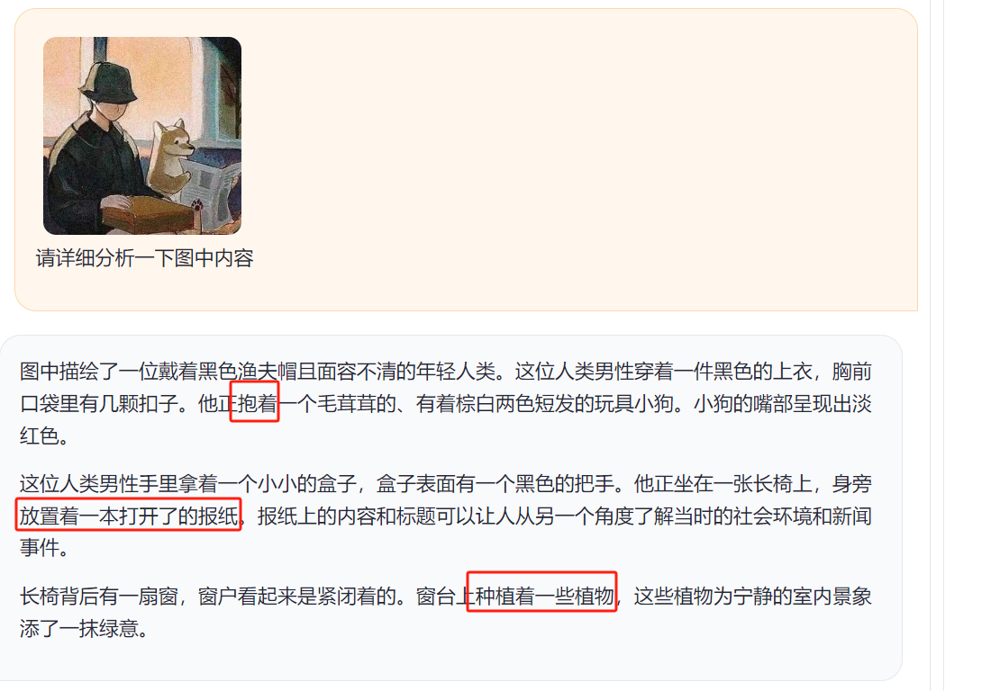

# InternLM第二课笔记-书生·浦语大模型趣味 Demo

# 实战任务一：部署 InternLM2-Chat-1.8B

创建 Intern Studio 开发机，通过 Modelscope 下载 InternLM2-Chat-1.8B 模型，完成 Client Demo 的部署和交互。

# 实战任务二：部署八戒-Chat-1.8B

通过 OpenXLab 部署 XiYou 系列的 八戒-Chat- 1.8B 模型，完成 Web Demo 的部署和交互。

部署中碰到一个问题：

* 在Windows系统下的VSCode安装Remote-SSH扩展后，使用扩展配置 SSH并进行远程连接，可能会发生 `Bad owner or permissions on C:\Users\Administrator/.ssh/config ` 错误，造成无法进行SSH远程连接的问题。原因是由于使用 `Remote-SSH`扩展所依赖的 **`Remote-SSH:Editing Configuration Files `扩展编辑了 `C:\Users\Administrator.ssh\config`文件后，此文件的权限发生了改变。编辑 `%USER HOME%.ssh\config` 文件后，不但在VSCode中由于配置文件权限问题而无法进行SSH远程连接，就连使用系统的 `PowerShell ` 进行SSH连接时也会报此错误，而把此配置文件删除后，使用PowerShell即可正常进行远程连接。但VSCode的SSH连接又依赖此配置文件，所以就产生了冲突，要么只有 `PowerShell`能用，要么就都不能用。
  

部署结果如下：


# 实战任务三：进阶 运行 Lagent 智能体 Demo

实战算力升级之后，以 InternLM2-Chat-7B 为基础，运行开源框架 Lagent 的智能体 Demo。

## 1. **Lagent 相关知识**

Lagent 是一个轻量级、开源的基于大语言模型的智能体（agent）框架，支持用户快速地将一个大语言模型转变为多种类型的智能体，并提供了一些典型工具为大语言模型赋能。它的整个框架图如下:



Lagent 的特性总结如下：

* 流式输出：提供 stream_chat 接口作流式输出，本地就能演示酷炫的流式 Demo。
* 接口统一，设计全面升级，提升拓展性，包括：
  * Model : 不论是 OpenAI API, Transformers 还是推理加速框架 LMDeploy 一网打尽，模型切换可以游刃有余；
  * Action: 简单的继承和装饰，即可打造自己个人的工具集，不论 InternLM 还是 GPT 均可适配；
  * Agent：与 Model 的输入接口保持一致，模型到智能体的蜕变只需一步，便捷各种 agent 的探索实现；
* 文档全面升级，API 文档全覆盖。

## 2. 使用Legent运行InternLM2-Chat-7B模型为内核的智能体

打开 lagent 路径：

```shell
cd /root/demo/lagent
```

在 terminal 中输入指令，构造软链接快捷访问方式：

```shell
ln -s /root/share/new_models/Shanghai_AI_Laboratory/internlm2-chat-7b /root/models/internlm2-chat-7b
```

打开 `lagent` 路径下 `examples/internlm2_agent_web_demo_hf.py` 文件，并修改对应位置 (71行左右) 代码：

```
# 其他代码...
value='/root/models/internlm2-chat-7b'
# 其他代码...
```

输入运行命令 - **点开 6006 链接后，大约需要 5 分钟完成模型加载：**

```shell
streamlit run /root/demo/lagent/examples/internlm2_agent_web_demo_hf.py --server.address 127.0.0.1 --server.port 6006
```

待程序运行的同时，对本地端口环境配置本地 `PowerShell` 。使用快捷键组合 `Windows + R`（Windows 即开始菜单键）打开指令界面，并输入命令，按下回车键。

```
# 从本地使用 ssh 连接 studio 端口
# 将下方端口号 38374 替换成自己的端口号
ssh -CNg -L 6006:127.0.0.1:6006 root@ssh.intern-ai.org.cn -p 38374 # 换为开发机中自己的端口号
```

在powershell中连接端口，会出现拒绝访问的情况，直接在cmd命令下输入即可。

打开 [http://127.0.0.1:6006](http://127.0.0.1:6006/) 后，（会有较长的加载时间）尝试了代码方面的对话，部分截图如下完成本章节实战。


# 实战任务四：进阶 灵笔 InternLM-XComposer2

浅尝多模态实践，通过 InternLM-XComposer2 模型实现更加强大的图文生成式写作。

## 1. **初步介绍 `XComposer2` 相关知识**

`浦语·灵笔2` 是基于 `书生·浦语2` 大语言模型研发的突破性的图文多模态大模型，具有非凡的图文写作和图像理解能力，在多种应用场景表现出色，总结起来其具有：

* 自由指令输入的图文写作能力： `浦语·灵笔2` 可以理解自由形式的图文指令输入，包括大纲、文章细节要求、参考图片等，为用户打造图文并貌的专属文章。生成的文章文采斐然，图文相得益彰，提供沉浸式的阅读体验。
* 准确的图文问题解答能力：`浦语·灵笔2` 具有海量图文知识，可以准确的回复各种图文问答难题，在识别、感知、细节描述、视觉推理等能力上表现惊人。
* 杰出的综合能力： `浦语·灵笔2-7B` 基于 `书生·浦语2-7B` 模型，在13项多模态评测中大幅领先同量级多模态模型，在其中6项评测中超过 `GPT-4V` 和 `Gemini Pro`。

## 2. 配置环境

进入开发机，启动 `conda` 环境：

```shell
conda activate demo
# 补充环境包
pip install timm==0.4.12 sentencepiece==0.1.99 markdown2==2.4.10 xlsxwriter==3.1.2 gradio==4.13.0 modelscope==1.9.5
```

下载 **InternLM-XComposer 仓库** 相关的代码资源：

```
cd /root/demo
git clone https://gitee.com/internlm/InternLM-XComposer.git
# git clone https://github.com/internlm/InternLM-XComposer.git
cd /root/demo/InternLM-XComposer
git checkout f31220eddca2cf6246ee2ddf8e375a40457ff626
```

在 `terminal` 中输入指令，构造软链接快捷访问方式：

```shell
ln -s /root/share/new_models/Shanghai_AI_Laboratory/internlm-xcomposer2-7b /root/models/internlm-xcomposer2-7b
ln -s /root/share/new_models/Shanghai_AI_Laboratory/internlm-xcomposer2-vl-7b /root/models/internlm-xcomposer2-vl-7b
```

## 3. 图文写作实战

真令人惊叹啊，预测next token的大模型竟能学到如此庞杂的知识。实践效果如下图所示：





## 4. 图片理解实战

可见模型会有幻想过度解读的情况



## 模型下载

使用 `Hugging Face` 官方提供的 `huggingface-cli` 命令行工具。安装依赖:

```
pip install -U huggingface_hub
```

然后新建 `python` 文件，填入以下代码，运行即可。

* resume-download：断点续下
* local-dir：本地存储路径。

其中 linux 环境下需要填写绝对路径.

```python
import os
# 下载模型
os.system('huggingface-cli download --resume-download internlm/internlm2-chat-7b --local-dir your_path')
```

以下内容将展示使用 `huggingface_hub` 下载模型中的部分文件

```python
import os 
from huggingface_hub import hf_hub_download  # Load model directly 

hf_hub_download(repo_id="internlm/internlm2-7b", filename="config.json")
```
