# InternLM第五课-LMDeploy量化部署LLM&VLM实践

## 1. LMDeploy环境部署

### InternStudio开发机创建conda环境（推荐）

由于环境依赖项存在torch，下载过程可能比较缓慢。InternStudio上提供了快速创建conda环境的方法。打开命令行终端，创建一个名为 `lmdeploy`的环境：

```shell
studio-conda -t lmdeploy -o pytorch-2.1.2
```

环境创建成功后，提示如下：

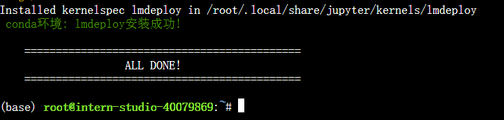

## 2. LMDeploy模型对话(chat)

### 2.1 Huggingface与TurboMind

[HuggingFace](https://huggingface.co/)是一个高速发展的社区，包括Meta、Google、Microsoft、Amazon在内的超过5000家组织机构在为HuggingFace开源社区贡献代码、数据集和模型。可以认为是一个针对深度学习模型和数据集的在线托管社区，如果你有数据集或者模型想对外分享，网盘又不太方便，就不妨托管在HuggingFace。

托管在HuggingFace社区的模型通常采用HuggingFace格式存储，简写为 **HF格式** 。

但是HuggingFace社区的服务器在国外，国内访问不太方便。国内可以使用阿里巴巴的[MindScope](https://www.modelscope.cn/home)社区，或者上海AI Lab搭建的[OpenXLab](https://openxlab.org.cn/home)社区，上面托管的模型也通常采用 **HF格式** 。

TurboMind是LMDeploy团队开发的一款关于LLM推理的高效推理引擎，它的主要功能包括：LLaMa 结构模型的支持，continuous batch 推理模式和可扩展的 KV 缓存管理器。

TurboMind推理引擎仅支持推理TurboMind格式的模型。因此，TurboMind在推理HF格式的模型时，会首先自动将HF格式模型转换为TurboMind格式的模型。**该过程在新版本的LMDeploy中是自动进行的，无需用户操作。**

几个容易迷惑的点：

* TurboMind与LMDeploy的关系：LMDeploy是涵盖了LLM 任务全套轻量化、部署和服务解决方案的集成功能包，TurboMind是LMDeploy的一个推理引擎，是一个子模块。LMDeploy也可以使用pytorch作为推理引擎。
* TurboMind与TurboMind模型的关系：TurboMind是推理引擎的名字，TurboMind模型是一种模型存储格式，TurboMind引擎只能推理TurboMind格式的模型。

### 2.2下载模型

InternStudio开发机上下载模型（推荐）

如果你是在InternStudio开发机上，可以按照如下步骤快速下载模型。

首先进入一个你想要存放模型的目录，本教程统一放置在Home目录。执行如下指令：

```shell
cd ~
```

然后执行如下指令由开发机的共享目录**软链接**或**拷贝**模型：

```shell
ln -s /root/share/new_models/Shanghai_AI_Laboratory/internlm2-chat-1_8b /root/
# cp -r /root/share/new_models/Shanghai_AI_Laboratory/internlm2-chat-1_8b /root/
```

执行完如上指令后，可以运行“ls”命令。可以看到，当前目录下已经多了一个 `internlm2-chat-1_8b`文件夹，即下载好的预训练模型。

### 2.3 使用Transformer库运行模型

运行python代码：

```shell
python /root/pipeline_transformer.py
```

得到输出：

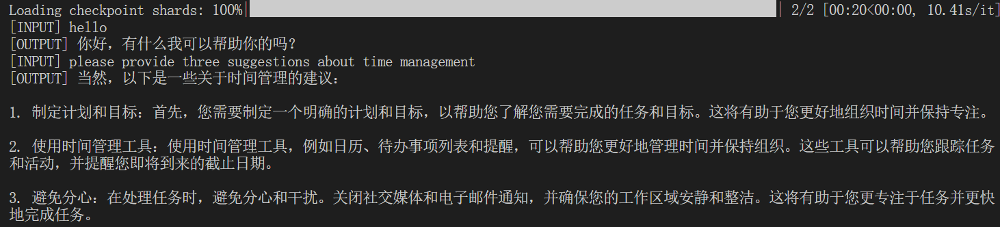

### 使用LMDeploy与模型对话

使用LMDeploy与模型进行对话的通用命令格式为：

```shell
lmdeploy chat [HF格式模型路径/TurboMind格式模型路径]
```

例如，您可以执行如下命令运行下载的1.8B模型：

```shell
lmdeploy chat /root/internlm2-chat-1_8b
```

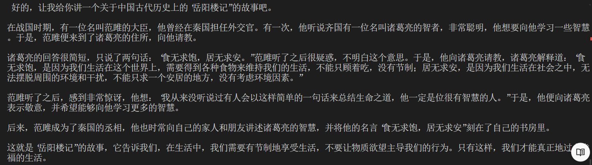**拓展内容** ：有关LMDeploy的chat功能的更多参数可通过-h命令查看。

## 3. LMDeploy模型量化lite

本部分内容主要介绍如何对模型进行量化。主要包括 KV8量化和W4A16量化。总的来说，量化是一种以参数或计算中间结果精度下降换空间节省（以及同时带来的性能提升）的策略。

正式介绍 LMDeploy 量化方案前，需要先介绍两个概念：

* 计算密集（compute-bound）: 指推理过程中，绝大部分时间消耗在数值计算上；针对计算密集型场景，可以通过使用更快的硬件计算单元来提升计算速度。
* 访存密集（memory-bound）: 指推理过程中，绝大部分时间消耗在数据读取上；针对访存密集型场景，一般通过减少访存次数、提高计算访存比或降低访存量来优化。

常见的 LLM 模型由于 Decoder Only 架构的特性，实际推理时大多数的时间都消耗在了逐 Token 生成阶段（Decoding 阶段），是典型的访存密集型场景。

那么，如何优化 LLM 模型推理中的访存密集问题呢？ 我们可以使用**KV8量化**和**W4A16**量化。KV8量化是指将逐 Token（Decoding）生成过程中的上下文 K 和 V 中间结果进行 INT8 量化（计算时再反量化），以降低生成过程中的显存占用。W4A16 量化，将 FP16 的模型权重量化为 INT4，Kernel 计算时，访存量直接降为 FP16 模型的 1/4，大幅降低了访存成本。Weight Only 是指仅量化权重，数值计算依然采用 FP16（需要将 INT4 权重反量化）。

### 3.1 设置最大KV Cache缓存大小

KV Cache是一种缓存技术，通过存储键值对的形式来复用计算结果，以达到提高性能和降低内存消耗的目的。在大规模训练和推理中，KV Cache可以显著减少重复计算量，从而提升模型的推理速度。理想情况下，KV Cache全部存储于显存，以加快访存速度。当显存空间不足时，也可以将KV Cache放在内存，通过缓存管理器控制将当前需要使用的数据放入显存。

模型在运行时，占用的显存可大致分为三部分：模型参数本身占用的显存、KV Cache占用的显存，以及中间运算结果占用的显存。LMDeploy的KV Cache管理器可以通过设置 `--cache-max-entry-count`参数，控制KV缓存**占用剩余显存**的最大比例。默认的比例为0.8。

```
lmdeploy chat /root/internlm2-chat-1_8b --cache-max-entry-count 0.5
```

### 3.2 使用W4A16量化

LMDeploy使用AWQ算法，实现模型4bit权重量化。推理引擎TurboMind提供了非常高效的4bit推理cuda kernel，性能是FP16的2.4倍以上。它支持以下NVIDIA显卡：

* 图灵架构（sm75）：20系列、T4
* 安培架构（sm80,sm86）：30系列、A10、A16、A30、A100
* Ada Lovelace架构（sm90）：40 系列

运行前，首先安装一个依赖库。

```shell
pip install einops==0.7.0
```

仅需执行一条命令，就可以完成模型量化工作。

```shell
lmdeploy lite auto_awq \
   /root/internlm2-chat-1_8b \
  --calib-dataset 'ptb' \
  --calib-samples 128 \
  --calib-seqlen 1024 \
  --w-bits 4 \
  --w-group-size 128 \
  --work-dir /root/internlm2-chat-1_8b-4bit
```

运行时间较长，请耐心等待。量化工作结束后，新的HF模型被保存到 `internlm2-chat-1_8b-4bit`目录。下面使用Chat功能运行W4A16量化后的模型。

```shell
lmdeploy chat /root/internlm2-chat-1_8b-4bit --model-format awq
```

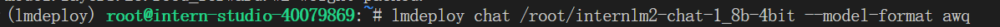

为了更加明显体会到W4A16的作用，我们将KV Cache比例再次调为0.01，查看显存占用情况。

```shell
lmdeploy chat /root/internlm2-chat-1_8b-4bit --model-format awq --cache-max-entry-count 0.01
```

**进阶作业1：**设置KV Cache最大占用比例为0.4，开启W4A16量化，以命令行方式与模型对话。

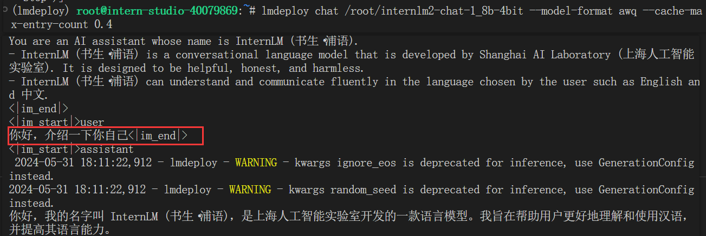

## 4. LMDeploy服务serve

在第二章和第三章，我们都是在本地直接推理大模型，这种方式成为本地部署。在生产环境下，我们有时会将大模型封装为API接口服务，供客户端访问。

我们来看下面一张架构图：

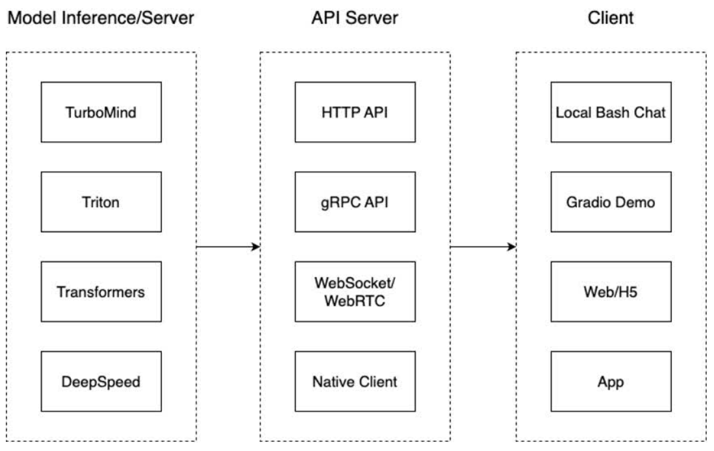

我们把从架构上把整个服务流程分成下面几个模块。

* 模型推理/服务。主要提供模型本身的推理，一般来说可以和具体业务解耦，专注模型推理本身性能的优化。可以以模块、API等多种方式提供。
* API Server。中间协议层，把后端推理/服务通过HTTP，gRPC或其他形式的接口，供前端调用。
* Client。可以理解为前端，与用户交互的地方。通过通过网页端/命令行去调用API接口，获取模型推理/服务。

值得说明的是，以上的划分是一个相对完整的模型，但在实际中这并不是绝对的。比如可以把“模型推理”和“API Server”合并，有的甚至是三个流程打包在一起提供服务。

### 4.1 启动API服务

通过以下命令启动API服务器，推理 `internlm2-chat-1_8b`模型：

```shell
lmdeploy serve api_server \
    /root/internlm2-chat-1_8b \
    --model-format hf \
    --quant-policy 0 \
    --server-name 0.0.0.0 \
    --server-port 23333 \
    --tp 1
```

其中，model-format、quant-policy这些参数是与第三章中量化推理模型一致的；server-name和server-port表示API服务器的服务IP与服务端口；tp参数表示并行数量（GPU数量）。

通过运行以上指令，我们成功启动了API服务器，请勿关闭该窗口，后面我们要新建客户端连接该服务。

可以通过运行一下指令，查看更多参数及使用方法：

```shell
lmdeploy serve api_server -h
```

你也可以直接打开 `http://{host}:23333`查看接口的具体使用说明。

注意，这一步由于Server在远程服务器上，所以本地需要做一下ssh转发才能直接访问。 **在你本地打开一个cmd窗口** ，输入命令如下：

```shell
ssh -CNg -L 23333:127.0.0.1:23333 root@ssh.intern-ai.org.cn -p 你的ssh端口号
```

ssh 端口号就是下面图片里的 39864，请替换为你自己的。

然后打开浏览器，访问 `http://127.0.0.1:23333`。

### 4.2 命令行客户端连接API服务器

在“4.1”中，我们在终端里新开了一个API服务器。

本节中，我们要新建一个命令行客户端去连接API服务器。

运行命令行客户端：

```shell
lmdeploy serve api_client http://localhost:23333
```

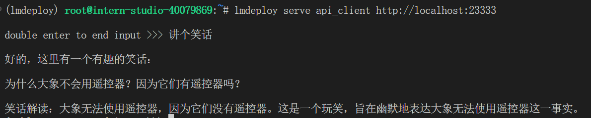

前端仅仅是显示，实际是在后端进行的模型推理，与之前命令行运行不同。

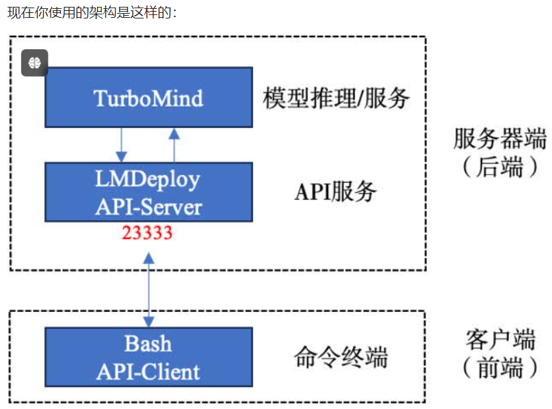

### 4.3 网页客户端连接API服务器

关闭刚刚的VSCode终端，但服务器端的终端不要关闭。

新建一个VSCode终端，激活conda环境。

```shell
conda activate lmdeploy
```

使用Gradio作为前端，启动网页客户端。

```shell
lmdeploy serve gradio http://localhost:23333 \
    --server-name 0.0.0.0 \
    --server-port 6006
```

运行命令后，网页客户端启动。在电脑本地新建一个cmd终端，新开一个转发端口：

```shell
ssh -CNg -L 6006:127.0.0.1:6006 root@ssh.intern-ai.org.cn -p <你的ssh端口号>
```

打开浏览器，访问地址 `http://127.0.0.1:6006`

然后就可以与模型进行对话了！

# 5.Python代码集成

在开发项目时，有时我们需要将大模型推理集成到Python代码里面。

## 5.1 Python代码集成运行1.8B模型

首先激活conda环境。

```shell
conda activate lmdeploy
```

新建Python源代码文件 `pipeline.py`。

```shell
touch /root/pipeline.py
```

打开 `pipeline.py`，填入以下内容。

```python
from lmdeploy import pipeline

pipe = pipeline('/root/internlm2-chat-1_8b')
response = pipe(['Hi, pls intro yourself', '上海是'])
print(response)
```

> **代码解读** ：\
>
> * 第1行，引入lmdeploy的pipeline模块 \
> * 第3行，从目录“./internlm2-chat-1_8b”加载HF模型 \
> * 第4行，运行pipeline，这里采用了批处理的方式，用一个列表包含两个输入，lmdeploy同时推理两个输入，产生两个输出结果，结果返回给response \
> * 第5行，输出response

保存后运行代码文件：

```shell
python /root/pipeline.py
```

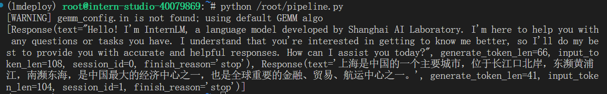

## 5.2 向TurboMind后端传递参数

在第3章，我们通过向lmdeploy传递附加参数，实现模型的量化推理，及设置KV Cache最大占用比例。在Python代码中，可以通过创建TurbomindEngineConfig，向lmdeploy传递参数。

以设置KV Cache占用比例为例，新建python文件 `pipeline_kv.py`。

```shell
touch /root/pipeline_kv.py
```

打开 `pipeline_kv.py`，填入如下内容：

```python
from lmdeploy import pipeline, TurbomindEngineConfig

# 调低 k/v cache内存占比调整为总显存的 20%
backend_config = TurbomindEngineConfig(cache_max_entry_count=0.4)

pipe = pipeline('/root/internlm2-chat-1_8b',
                backend_config=backend_config)
response = pipe(['Hi, pls intro yourself', '上海是'])
print(response)
```

保存后运行python代码：

```shell
python /root/pipeline_kv.py
```

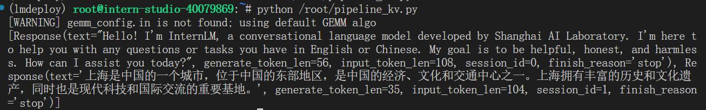

# 6. 拓展部分

## 6.1 使用LMDeploy运行视觉多模态大模型llava

最新版本的LMDeploy支持了llava多模态模型，下面演示使用pipeline推理 `llava-v1.6-7b`。**注意，运行本pipeline最低需要30%的InternStudio开发机，请完成基础作业后向助教申请权限。**

安装llava依赖库。

```shell
pip install git+https://github.com/haotian-liu/LLaVA.git@4e2277a060da264c4f21b364c867cc622c945874
```

新建一个python文件，比如 `pipeline_llava.py`。

```shell
touch /root/pipeline_llava.py
```

打开 `pipeline_llava.py`，填入内容如下：

```python
from lmdeploy.vl import load_image
from lmdeploy import pipeline, TurbomindEngineConfig


backend_config = TurbomindEngineConfig(session_len=8192) # 图片分辨率较高时请调高session_len
# pipe = pipeline('liuhaotian/llava-v1.6-vicuna-7b', backend_config=backend_config) 非开发机运行此命令
pipe = pipeline('/share/new_models/liuhaotian/llava-v1.6-vicuna-7b', backend_config=backend_config)

image = load_image('https://raw.githubusercontent.com/open-mmlab/mmdeploy/main/tests/data/tiger.jpeg')
response = pipe(('describe this image', image))
print(response)
```

保存后运行pipeline。

```shell
python /root/pipeline_llava.py
```

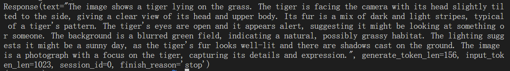

我们也可以通过Gradio来运行llava模型。新建python文件 `gradio_llava.py`。

```shell
touch /root/gradio_llava.py
```

打开文件，填入以下内容：

```python
import gradio as gr
from lmdeploy import pipeline, TurbomindEngineConfig


backend_config = TurbomindEngineConfig(session_len=8192) # 图片分辨率较高时请调高session_len
# pipe = pipeline('liuhaotian/llava-v1.6-vicuna-7b', backend_config=backend_config) 非开发机运行此命令
pipe = pipeline('/share/new_models/liuhaotian/llava-v1.6-vicuna-7b', backend_config=backend_config)

def model(image, text):
    if image is None:
        return [(text, "请上传一张图片。")]
    else:
        response = pipe((text, image)).text
        return [(text, response)]

demo = gr.Interface(fn=model, inputs=[gr.Image(type="pil"), gr.Textbox()], outputs=gr.Chatbot())
demo.launch()   
```

运行python程序。

```shell
python /root/gradio_llava.py
```

通过ssh转发一下7860端口。

```shell
ssh -CNg -L 7860:127.0.0.1:7860 root@ssh.intern-ai.org.cn -p <你的ssh端口>
```

通过浏览器访问 `http://127.0.0.1:7860`。
